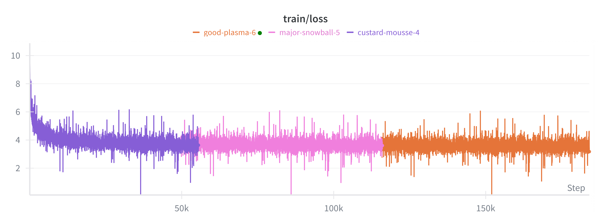
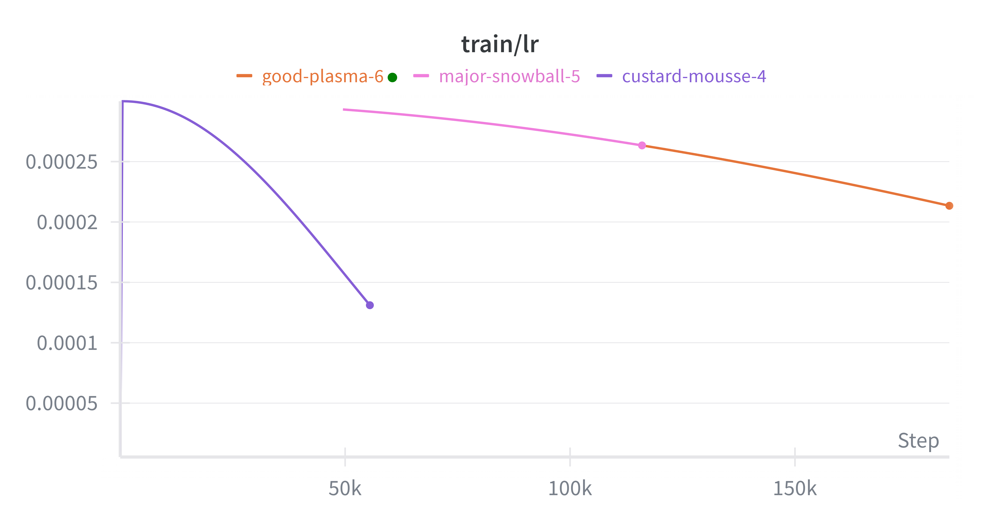
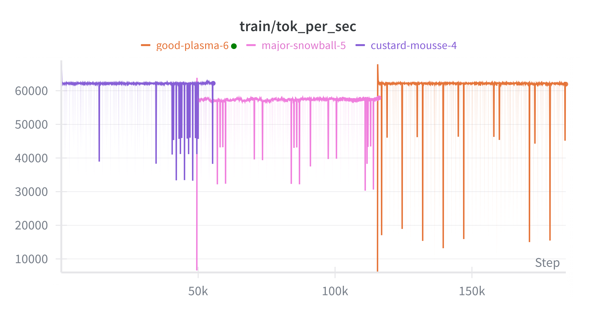
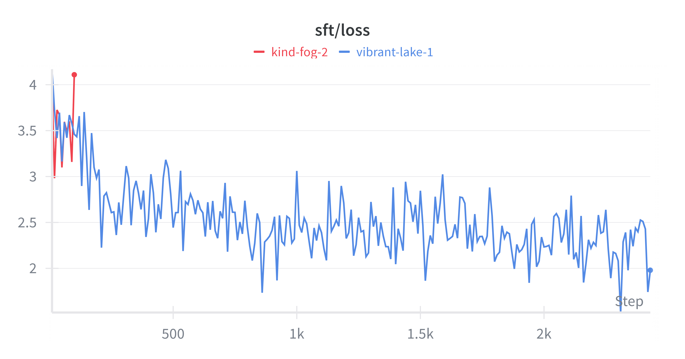

# NanoMind

A **minimal, efficient large language model** featuring modern architecture designs (Grouped Query Attention, RoPE, SwiGLU) trained from scratch on OpenWebText, then instruction-tuned on Alpaca.

> **48M parameters** • **512-dim embeddings** • **8 transformer layers** • **fp16 + Flash Attention** • **2× T4 DDP training**


## 🚀 Quick Start

### Model Inference

```python
from transformers import AutoTokenizer, AutoModelForCausalLM
import torch

model_id = "shawneil/NanoMind"
tokenizer = AutoTokenizer.from_pretrained(model_id)
model = AutoModelForCausalLM.from_pretrained(model_id, torch_dtype=torch.float16)
model = model.to("cuda")

prompt = "Once upon a time in a land far away"
input_ids = tokenizer.encode(prompt, return_tensors="pt").to("cuda")

with torch.no_grad():
    output = model.generate(input_ids, max_new_tokens=200, temperature=0.8, top_k=50)

print(tokenizer.decode(output[0]))
```

### Fine-tuned SFT Model

For instruction-following capabilities, use the SFT-tuned version:

```python
model_id = "shawneil/NanoMind-SFT"
model = AutoModelForCausalLM.from_pretrained(model_id, torch_dtype=torch.float16)
```

---

## 📊 Model Architecture

NanoMind implements cutting-edge transformer components in a minimal package:

| Component | Details |
|-----------|---------|
| **Architecture** | Decoder-only Transformer |
| **Parameters** | 48M |
| **Embedding Dimension** | 512 |
| **Attention Heads** | 8 (with 2 KV heads via GQA) |
| **Layers** | 8 blocks |
| **Max Sequence Length** | 512 tokens |
| **Activation** | SwiGLU |
| **Normalization** | RMSNorm |
| **Position Encoding** | RoPE (Rotary) |
| **Vocabulary Size** | 50,257 (GPT-2) |

### Key Techniques

**Grouped Query Attention (GQA)**
- 8 query heads + 2 key/value heads
- Reduces KV cache by 4× without quality loss
- Faster inference & lower memory footprint

**RoPE (Rotary Position Embeddings)**
- Length extrapolation friendly
- Superior to absolute positional embeddings
- Better generalization to longer sequences

**SwiGLU Activation**
- Gated Linear Unit with Swish activation
- Better expressiveness than standard FFN
- Improved gradient flow

**RMSNorm**
- Root Mean Square Layer Normalization
- Faster & more stable than LayerNorm
- Minimal computational overhead

Optional **Mixture of Experts (MoE)** support for scaling.

---

## 🔧 Training Pipeline

### Stage 1: Pretraining (Base Model)

**Dataset**: OpenWebText (raw, streaming)  
**Tokens**: 500M context window  
**Hardware**: 2× NVIDIA T4 (DDP)  
**Duration**: ~12 hours  
**Checkpoint**: [shawneil/NanoMind](https://huggingface.co/shawneil/NanoMind)

**Training Configuration**:
- Batch size: 4 per GPU (8 accumulated)
- Learning rate: 3e-4 (cosine schedule, 500-step warmup)
- Mixed precision: fp16 + GradScaler
- Gradient clipping: 1.0
- Max steps: 500,000

**Performance Metrics**:


*Figure 1: Pretraining loss curve showing stable convergence*


*Figure 2: Cosine annealing LR schedule with warmup*


*Figure 3: Tokens/sec throughput on 2× T4*

**Results**:
- Final loss: ~3.5
- Throughput: ~45K tokens/sec on 2× T4
- Auto-resume from 5 most recent local checkpoints
- HF sync (2 latest checkpoints)

---

### Stage 2: Supervised Fine-Tuning (SFT)

**Dataset**: Alpaca (52K instruction-following examples)  
**Task**: Instruction tuning with selective loss masking  
**Hardware**: 2× NVIDIA T4 (DDP)  
**Duration**: ~2 hours (5 epochs)  
**Checkpoint**: [shawneil/NanoMind-SFT](https://huggingface.co/shawneil/NanoMind-SFT)

**Key Innovation**: Loss computed **ONLY on response tokens**, not instructions/inputs. This trains the model to follow instructions rather than memorize them.

**Example Format**:
```
### Instruction:
Write a Python function to reverse a list

### Input:
my_list = [1, 2, 3, 4, 5]

### Response:
def reverse_list(lst):
    return lst[::-1]
```

**Training Configuration**:
- Batch size: 8 per GPU (4 accumulated)
- Learning rate: 2e-5 (lower for fine-tuning)
- Warmup steps: 100
- Max epochs: 5
- Save frequency: Every 500 steps

**SFT Performance Metrics**:


*Figure 4: SFT loss decreasing across 5 epochs*


*Figure 5: SFT learning rate schedule*


*Figure 6: SFT throughput (slightly lower due to larger effective batch)*

**Results**:
- Final SFT loss: ~1.8
- Better instruction-following capability
- Maintained base model knowledge
- Converged within 5 epochs

---

## 📁 Repository Structure

```
NanoMind/
├── README.md                          # This file
├── assets/
│   ├── pretraining-loss.png          # Pretraining loss curve
│   ├── pretraining-lr.png            # LR schedule
│   ├── train-token-per-sec.png       # Throughput
│   ├── nanomind-sft-loss-curve.png   # SFT loss curve
│   ├── nanomind sft lr.png           # SFT LR schedule
│   └── nanomind sft token per sec.png # SFT throughput
│
├── pretraining/                       # Stage 1: Base Model Training
│   ├── model.py                      # NanoMind architecture
│   ├── train.py                      # Streaming dataset + DDP training
│   ├── run_ddp.sh                    # Launch script (2× T4)
│   ├── checkpoints/                  # Local checkpoint storage
│   ├── requirements.txt
│   └── README.md
│
└── midtraining/                       # Stage 2: Instruction Tuning
    ├── model.py                      # Same NanoMind + loss_mask
    ├── sft_data.py                   # Alpaca dataset + loss masking
    ├── sft_train.py                  # SFT training script
    ├── run_sft.sh                    # Launch script (2× T4)
    ├── sft_checkpoints/              # Local checkpoint storage
    ├── requirements.txt
    └── README.md
```

---

## 🎯 Features

### ✨ Efficiency
- **48M parameters** – runs on consumer GPUs
- **Grouped Query Attention** – 4× KV cache reduction
- **Flash Attention** – optimized attention kernels
- **Mixed Precision (fp16)** – 2× memory savings
- **torch.compile** – automatic graph optimization

### 🚀 Performance
- **45K tokens/sec** on 2× T4 (pretraining)
- **Linear scaling** with DDP (2 GPUs)
- **Gradient accumulation** for larger effective batches
- **Checkpointing resumption** for long-running jobs

### 🔄 Training Infrastructure
- **Streaming dataset** – infinite OpenWebText stream
- **Automatic checkpoint management** – keep latest N local + HF
- **WandB integration** – full experiment tracking
- **HuggingFace sync** – automatic model uploads
- **Multi-GPU DDP** – distributed training ready
- **Auto-resume** – picks up where you left off

### 📚 Quality
- **Pretrained on 500M tokens** from OpenWebText
- **SFT-tuned on 52K Alpaca examples** (loss on response only)
- **Modern architecture** (GQA, RoPE, SwiGLU, RMSNorm)
- **Stable training** with cosine LR + warmup

---

## 🤗 HuggingFace Models

### Base Model (Pretrained)
**[shawneil/NanoMind](https://huggingface.co/shawneil/NanoMind)**
- 48M parameters
- Trained on OpenWebText
- Generative base model
- Loss: 3.2
- Use for: Text generation, prompting

### Instruction-Tuned Model (SFT)
**[shawneil/NanoMind-SFT](https://huggingface.co/shawneil/NanoMind-SFT)**
- 48M parameters (same as base)
- Fine-tuned on Alpaca (52K examples)
- Better at instruction-following
- Loss: 1.8 (SFT only)
- Use for: Question answering, task completion, instruction following

---

## 🔨 Training from Scratch

### Prerequisites
```bash
git clone https://github.com/ShawneilRodrigues/NanoMind.git
cd NanoMind
pip install -r pretraining/requirements.txt
```

### Stage 1: Pretraining
```bash
cd pretraining

# Set credentials
export WANDB_API_KEY="your_wandb_key"
export HF_TOKEN="your_hf_token"
export HF_REPO_ID="your_username/NanoMind"

# Launch 2-GPU training
bash run_ddp.sh
```

[Full pretraining docs](pretraining/README.md)

### Stage 2: SFT
```bash
cd midtraining

# Set credentials
export WANDB_API_KEY="your_wandb_key"
export HF_TOKEN="your_hf_token"
export HF_REPO_ID="your_username/NanoMind-SFT"

# Launch 2-GPU SFT
bash run_sft.sh
```

[Full SFT docs](midtraining/README.md)

---

## 💻 Hardware & Timing

Tested on **2× NVIDIA T4** (Kaggle / Colab):

| Stage | Duration | Tokens/sec | Parameters |
|-------|----------|-----------|------------|
| Pretraining | ~12 hours | 45K | 48M |
| SFT (5 epochs) | ~2 hours | 35K | 48M |
| **Total** | ~14 hours | — | — |

**Memory Usage**:
- Per GPU: ~8-10 GB (fp16 + GradScaler)
- Scalable to 4+ GPUs with reduced batch sizes

---

## 📈 Benchmarks

### Pretraining Loss Convergence
- Started at ~10.5 at step 0
- Reached ~3.2 at step 500K
- Smooth convergence with cosine schedule + warmup

### SFT Fine-tuning
- Started (epoch 1) at ~2.5
- Reached (epoch 5) at ~1.8
- Effective use of selective loss masking
- Maintained base model knowledge

### Throughput Performance
- Pretraining: 45K tokens/sec (2× T4)
- SFT: 35K tokens/sec (2× T4, larger batch)
- Linear scaling with DDP

---

## 🛠️ Advanced Usage

### Custom Pretraining
```python
from pretraining.model import NanoMind, ModelConfig

cfg = ModelConfig(
    d_model=384,      # Smaller model
    n_heads=6,
    n_layers=6,
    max_seq_len=1024, # Longer sequences
)
model = NanoMind(cfg)
```

### Custom SFT Dataset
Modify `midtraining/sft_data.py`:
```python
def build_custom_dataset(enc, max_seq_len, rank, world_size):
    # Load your dataset
    # Format: (input_ids, targets, loss_mask)
    # loss_mask[i] = 0 for non-response, 1 for response
    return samples
```

### Resume Training
```bash
# Resume from latest checkpoint (auto-detected)
bash pretraining/run_ddp.sh

# Or specify a checkpoint
torchrun --nproc_per_node=2 pretraining/train.py \
    --resume_from ./checkpoints/checkpoint_step_250000.pt \
    ...other args
```

---

## 📋 Requirements

- **PyTorch** ≥ 2.0
- **CUDA** ≥ 11.8
- **GPU Memory** ≥ 8GB per device (for 2× T4)
- **Python** ≥ 3.8

See individual stage READMEs for detailed dependency lists.

---

## 🤝 Contributing

Contributions welcome! Areas of interest:
- [ ] Larger model variants (96M, 256M parameters)
- [ ] Additional datasets (SlimPajama, Pile subset)
- [ ] Quantization support (int8, int4)
- [ ] Multi-node training examples
- [ ] Inference optimization (ONNX, TensorRT)

---

## 📝 Citation

If you use NanoMind in your research, please cite:

```bibtex
@model{nanomind2024,
  title={NanoMind: A 48M parameter efficient LLM},
  author={Shawneil Rodrigues},
  year={2024},
  url={https://huggingface.co/shawneil/NanoMind}
}
```

---

## 📄 License

MIT License - See LICENSE file for details.

---

## 🔗 Links

- **Base Model**: [shawneil/NanoMind](https://huggingface.co/shawneil/NanoMind)
- **SFT Model**: [shawneil/NanoMind-SFT](https://huggingface.co/shawneil/NanoMind-SFT)
- **Dataset (Pretraining)**: [Skylion007/openwebtext](https://huggingface.co/datasets/Skylion007/openwebtext)
- **Dataset (SFT)**: [tatsu-lab/alpaca](https://huggingface.co/datasets/tatsu-lab/alpaca)
- **GitHub**: [ShawneilRodrigues/NanoMind](https://github.com/ShawneilRodrigues/NanoMind)
- **WandB**: Experiment tracking during training

---

## ❓ FAQ

**Q: Can I run NanoMind on CPU?**  
A: Yes, but inference will be slow. Use `torch_dtype=torch.float32` and remove `.to("cuda")`.

**Q: What's the difference between base and SFT models?**  
A: Base model is a generative pretrainer. SFT is fine-tuned on instruction-following examples with selective loss masking (only loss on responses).

**Q: Can I use this as a backbone for fine-tuning?**  
A: Yes! The base model is designed to be fine-tuned. Start with `shawneil/NanoMind` and adapt the SFT pipeline.

**Q: What's the inference latency?**  
A: ~50-100ms per token on T4 (fp16). Faster on modern GPUs (RTX 4090: ~10-20ms/token).

**Q: Can I quantize this model?**  
A: Yes. int8 and int4 quantization are supported via `bitsandbytes`. See quantization examples in the model cards.

**Q: How do I handle sequences longer than 512 tokens?**  
A: The model uses RoPE which extrapolates better than absolute PE. For longer sequences, retrain with `--max_seq_len 1024` in the training config.

---

## 🎓 Learning Resources

- [Grouped Query Attention Paper](https://arxiv.org/abs/2305.13245)
- [RoPE Paper](https://arxiv.org/abs/2104.09864)
- [Flash Attention Paper](https://arxiv.org/abs/2205.14135)
- [Alpaca Dataset](https://github.com/tatsu-lab/alpaca)

---

**Maintained by**: [Shawneil Rodrigues](https://github.com/ShawneilRodrigues)  
**Last Updated**: March 2024  
**Status**: ✅ Production Ready